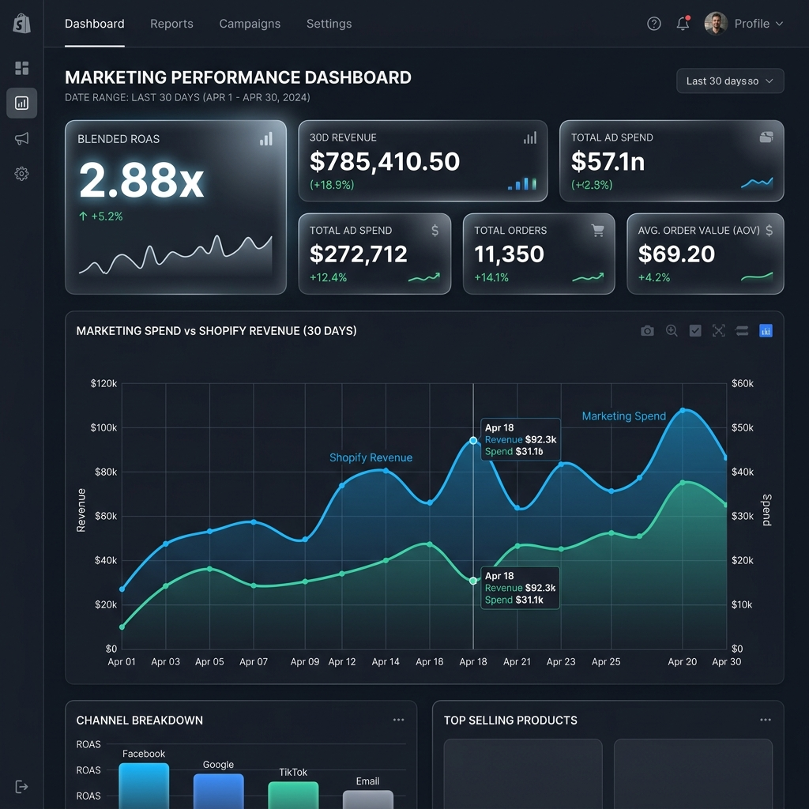
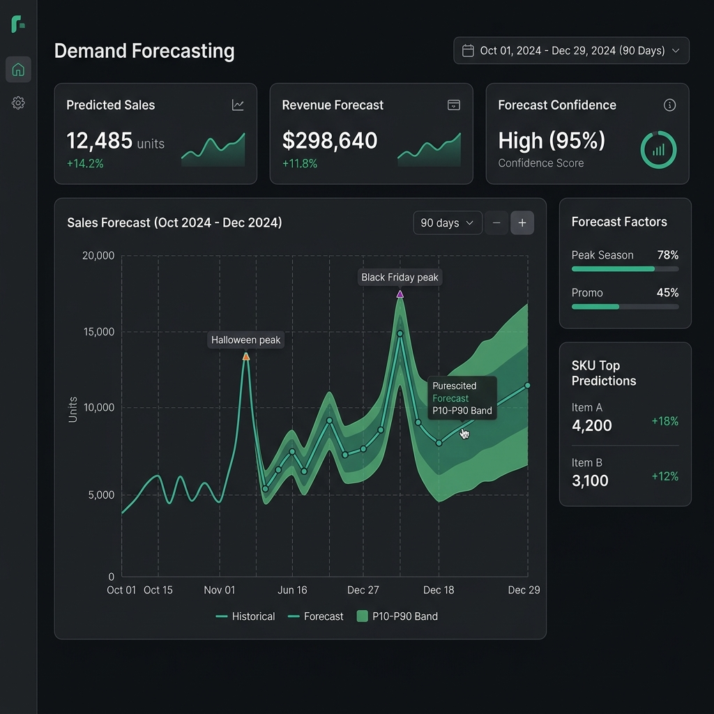
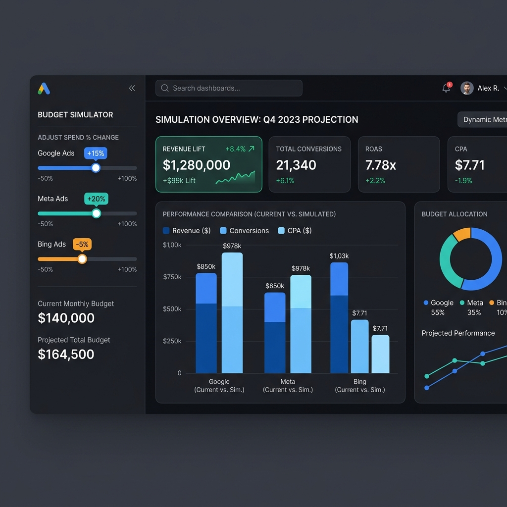
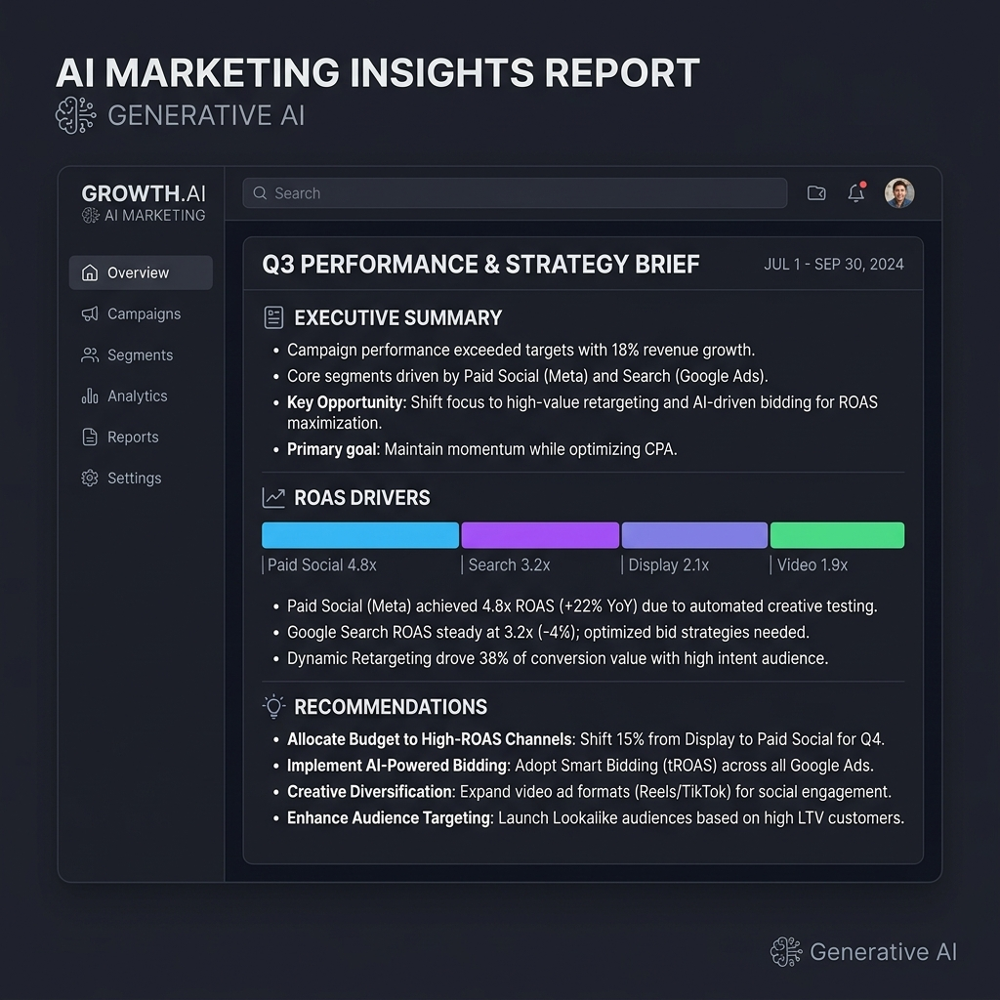

# AI Revenue Intelligence: Predictive Decision Support & Budget Optimization

AI Revenue Intelligence is a production-ready marketing decision-support system that consolidates marketing campaign performance data, forecasts future performance bounds, models budget scenarios under saturation curves, and drafts executive strategies using Generative AI.

This platform is built for the **NetElixir AIgnition 3.0 Hackathon**.

---

## 🚀 Key Features

- **Multi-Source Data Ingestion & Quality Audit**: Dynamic validation of schemas across Google Ads, Meta Ads, Microsoft Ads, GA4, and Shopify datasets, featuring Z-Score outlier detection.
- **Autoregressive Feature Engineering**: Automatic calculation of lag matrices, rolling stats, cyclic temporal seasonality, and channel spend distributions.
- **Hybrid Time-Series Ensemble**: Combines Prophet (seasonal components) with XGBoost and LightGBM (tabular marketing metrics) via a weighted point forecast (P50).
- **Probabilistic Risk-Bounding**: Employs Quantile Regression (loss='quantile') to predict P10 (conservative) and P90 (optimistic) confidence ribbons.
- **Upgraded Saturation Simulator**: Models marketing spend adjustments under diminishing returns saturation curves, calibrated dynamically on historical conversion shares.
- **Continuous Performance Auditing**: Checks for conversion rate drops, ROAS decay (increasing spend with decreasing ROAS), and auction CPC spikes.
- **LLM Strategy Engine**: Connects to Gemini/OpenAI API to formulate business briefings, supported by an offline dynamic report fallback.
- **Downloadable Reports**: Compiles summaries into a print-ready HTML executive report that converts to PDF via standard browser print dialogs.

---

## 📐 System Architecture

```
                       Data Sources (Shopify, Google, Meta, Bing, GA4)
                                             │
                                             ▼
                                Data Validation & Auditing
                                             │
                                             ▼
                                Feature Engineering Module
                                             │
                                             ▼
                         ML Modeling Core (Ensemble & Quantiles)
                                             │
                       ┌─────────────────────┼─────────────────────┐
                       ▼                     ▼                     ▼
                 Point Forecast     Probabilistic Bands    Budget Simulator
                 (Prophet/XGB/LGB)       (P10/P90)         (Saturation Curves)
                       │                     │                     │
                       └─────────────────────┬─────────────────────┘
                                             │
                                             ▼
                                   Marketing Risk Engine
                                             │
                                             ▼
                                     AI Insights Engine
                                             │
                                             ▼
                                   Streamlit / PDF Reports
```

---

## 📂 Folder Structure

```
AI-Revenue-Intelligence/
├── run.sh                  # Shell script for CLI prediction runner
├── run.bat                 # Windows CMD runner wrapper
├── run.ps1                 # PowerShell runner wrapper
├── requirements.txt        # Package dependencies
├── README.md               # Master documentation
├── streamlit_app.py        # Streamlit App dashboard entrypoint
├── data/                   # Historical data directory
│   ├── sample_google_ads.csv
│   ├── sample_meta_ads.csv
│   ├── sample_microsoft_ads.csv
│   ├── sample_shopify.csv
│   └── sample_ga4.csv
├── pickle/                 # Serialized model directory
│   └── model.pkl
├── output/                 # Output predictions directory
│   └── predictions.csv
├── src/                    # Source code package
│   ├── __init__.py
│   ├── data_pipeline.py    # Validation and cleaning pipeline
│   ├── feature_engineering.py # Lag and seasonality engineering
│   ├── models.py           # Model structures and ensemble classes
│   ├── train.py            # Model training execution script
│   ├── predict.py          # Prediction CLI script
│   ├── simulator.py        # Channel budget simulator math
│   ├── risk_engine.py      # Marketing risk and drop checks
│   ├── explainability.py   # Feature importances and attributions
│   ├── llm_engine.py       # LLM API connection & Mock fallback
│   └── report_generator.py # HTML Executive Report compiler
└── docs/                   # Supporting documentation
    ├── system_architecture.md # Technical architectures
    ├── presentation.md     # Hackathon pitch slides outline
    ├── demo_script.md      # Step-by-step live demo guidelines
    └── deployment_guide.md # Production deployment walkthroughs
```

---

## 💻 Installation

1. **Clone & Navigate**:
   ```bash
   git clone https://github.com/yourusername/AI-Revenue-Intelligence.git
   cd AI-Revenue-Intelligence
   ```
2. **Environment & Setup**:
   ```bash
   python -m venv venv
   source venv/bin/activate  # Windows: .\venv\Scripts\activate
   pip install -r requirements.txt
   ```

---

## ⚙️ Model Training & CLI Execution

### 1. Model Training (Executed Once)
Train the ensemble model on the historical data and save the serialized weights package to the `pickle/` folder:
```bash
python src/train.py --data ./data --pickle-dir ./pickle
```
*Output: Saves a combined model pack to `pickle/model.pkl`.*

### 2. Prediction CLI Execution (Grading Runner)
Generate a 90-day P10/P50/P90 forecast on the input datasets:
```bash
# On Linux / macOS / Git Bash:
./run.sh ./data ./pickle/model.pkl ./output/predictions.csv

# On Windows Command Prompt:
run.bat ./data ./pickle/model.pkl ./output/predictions.csv

# On Windows PowerShell:
.\run.ps1 ./data ./pickle/model.pkl ./output/predictions.csv
```
*Output: Writes exactly the 7 required prediction columns to `output/predictions.csv`.*

---

## 📈 CLI Output Format (`predictions.csv`)
The CLI outputs predictions matching the required schema:
| Column | Type | Description |
| :--- | :--- | :--- |
| **Forecast_Period** | Text | Day 1 to Day 90 indexes |
| **Revenue_P10** | Numeric | Pessimistic lower bound revenue |
| **Revenue_P50** | Numeric | Blended Ensemble expected revenue |
| **Revenue_P90** | Numeric | Optimistic upper bound revenue |
| **ROAS_P10** | Numeric | Pessimistic lower bound ROAS |
| **ROAS_P50** | Numeric | Blended Ensemble expected ROAS |
| **ROAS_P90** | Numeric | Optimistic upper bound ROAS |

---

## 📊 Streamlit Dashboard Interface

To launch the interactive dashboard:
```bash
streamlit run streamlit_app.py
```
### Dashboard Pages:
1. **Dashboard Home**: High-level KPI cards, blended spend vs. sales graphs, and channel-level table breakdowns.
2. **Data Ingestion & Validation**: Displays schema checklists and outliers detected by Z-Score.
3. **Forecasting Engine**: View P10/P50/P90 forecast ribbons, confidence scores, and SHAP feature importances.
4. **Budget Simulator**: Use sliders to adjust channel spend. View simulated Revenue, ROAS, and Saturation Risk alerts.
5. **AI Insights Engine**: Enter Gemini/OpenAI keys to generate narrative brief summaries. Supports local fallback.
6. **Reports Hub**: Render a print-friendly light HTML executive report and download it locally.

---

## 🧪 Methodology & Modeling Math

### 1. Weighted Ensemble Blending
The point forecast ($y_{ensemble}$) is a weighted combination of Prophet, XGBoost, and LightGBM models:
$$y_{ensemble} = w_1 \cdot y_{prophet} + w_2 \cdot y_{xgb} + w_3 \cdot y_{lgbm}$$
*Weights: $w_1 = 0.3$, $w_2 = 0.4$, $w_3 = 0.3$.*

### 2. Probabilistic Bounds (Quantile Loss)
To calculate $y_{p10}$ and $y_{p90}$, we train separate `GradientBoostingRegressor` models using the pinball loss function:
$$L_q(y, \hat{y}) = \max(q(y - \hat{y}), (q - 1)(y - \hat{y}))$$
*Lower bound set to $q=0.10$, upper bound set to $q=0.90$.*

### 3. Saturation Curves
Simulated spend ($S'$) translates to revenue using calibrated logarithmic curves:
$$Revenue_{simulated} = Revenue_{organic} + \sum_{i} \alpha_i \cdot \ln(Spend_i' + 2)$$
Alphas ($\alpha_i$) calibrate dynamically using channel conversion shares:
$$\alpha_i = \frac{Attributed\_Revenue_i}{\ln(Spend_i + 2)}$$
This guarantees the simulator operates within realistic historical limits.

---

## 🔮 Future Enhancements

- **Direct API Pipelines**: Sync data automatically via official Shopify webhook and Meta/Google Ads API tokens.
- **Dynamic Bidding Automation**: Integrate webhooks to automatically scale or scale-down daily ad bids based on forecast alerts.
- **Multi-tenant SaaS Portal**: Expand into a multi-tenant subscription software platform for independent agency clients.

---

## 🖼️ Dashboard Showcase & Screenshots

### 📊 Executive Home Dashboard


### 🔮 Probabilistic Forecasting Engine


### 🎛️ Upgraded Budget Simulator


### 🤖 Generative AI Marketing Insights

